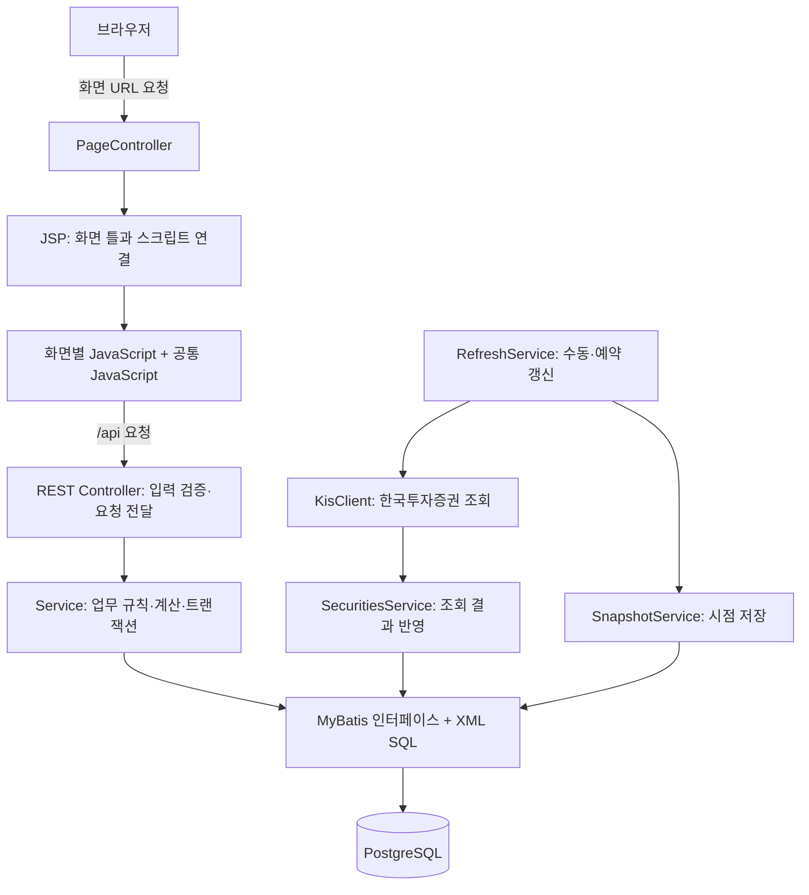

# 처음 읽는 프로젝트 구조 안내

이 프로젝트는 부부의 계좌·거래·카드·대출·증권을 한곳에서 관리하는 로컬 웹 애플리케이션입니다. 브라우저에서 사용하지만, 화면과 API는 하나의 Spring Boot 서버가 제공하고 데이터는 PostgreSQL에 저장합니다.

처음에는 **전체 구조 → 화면과 파일 지도 → 거래 저장 예시 → 데이터와 업무 규칙** 순서로 읽으면 됩니다. 실행 절차는 아래의 실행 항목과 [README](../README.md)를 함께 참고하세요. 이 문서는 현재 저장소의 소스를 기준으로 작성했습니다.

## 1. 전체 구조



화면 요청과 데이터 요청을 구분하면 코드를 찾기 쉽습니다. `/transactions`는 JSP 화면을 열고, `/api/transactions`는 화면에 표시할 거래 데이터를 반환합니다. JSP는 주로 화면의 틀을 제공하며 실제 조회·표 생성·이벤트 처리는 JavaScript가 담당합니다.

| 기술 | 이 프로젝트에서 하는 일 |
|---|---|
| Java 21 / Spring Boot 4.1.1 | 서버 실행, HTTP 요청 처리, 업무 로직 실행. 버전은 `build.gradle` 기준 |
| JSP / JSTL | 공통 레이아웃과 화면별 HTML 제공 |
| 일반 JavaScript / CSS | API 호출, 목록·모달·차트·화면 스타일. 별도 프런트엔드 빌드 설정은 없음 |
| MyBatis | Java 메서드와 XML에 작성한 SQL 연결 |
| PostgreSQL | 계좌, 원장, 예정거래, 스냅샷 영구 저장 |
| Gradle Wrapper | 빌드·테스트·실행. 배포 산출물은 실행 가능한 WAR |

## 2. 폴더 지도

```text
asset-manager/
├─ README.md                       기능과 실행 안내
├─ MAINTENANCE.md                  화면 수정 위치와 UI 유지보수 안내
├─ UI_UPDATE.md                    기존 사용자용 UI 업데이트 안내
├─ docs/PROJECT_GUIDE.md           이 문서
├─ build.gradle / settings.gradle 빌드·의존성·프로젝트 설정
├─ gradlew / gradlew.bat           Gradle 실행 진입점
├─ gradle/wrapper/                Gradle Wrapper 구성
├─ application-local.example.yml  로컬 설정 작성 예시
├─ db/
│  ├─ create_database.sql         DB와 사용자 생성
│  ├─ schema.sql                  최초 테이블 생성
│  ├─ seed.sql                    기본 카테고리 데이터
│  └─ migrations/                기존 DB 변경 스크립트
├─ src/main/java/com/family/asset/
│  ├─ AssetManagerApplication.java 서버 시작, Mapper 탐색, 스케줄 활성화
│  ├─ controller/                화면 URL과 REST API 진입점
│  ├─ service/                   업무 규칙·잔액 변경·집계
│  ├─ mapper/                    SQL 호출용 Java 인터페이스
│  ├─ dto/                       데이터 전달 객체와 요청 record
│  ├─ enums/                     소유자·자산·거래 유형 코드와 표시명
│  ├─ kis/                       외부 증권 API, 인증 설정, 결과 모델
│  ├─ config/                    JSON 직렬화 설정
│  └─ exception/                 업무 오류와 공통 API 오류 응답
├─ src/main/resources/
│  ├─ application.yml            서버·DB·MyBatis·KIS 설정
│  ├─ mapper/*.xml               실제 SQL
│  └─ static/
│     ├─ app.css / images/       공통 스타일과 이미지
│     └─ js/common/ / js/pages/  공통 기능과 화면별 동작
├─ src/main/webapp/WEB-INF/views/
│  ├─ *.jsp                      화면별 HTML 틀
│  └─ common/*.jspf               공통 헤더·모달·스크립트 연결
├─ src/test/java/                Java 단위 테스트
└─ tests/                        Node·브라우저·실제 API 검증 스크립트
```

`build/`는 빌드 결과, `.gradle/`는 Gradle 작업 데이터, `.idea/`는 IDE 설정, `logs/`는 실행 로그입니다. 기능을 이해할 때는 `src/`와 `db/`부터 읽으면 됩니다.

## 3. 화면에서 소스 찾기

모든 화면 URL은 [PageController.java](../src/main/java/com/family/asset/controller/PageController.java)에 모여 있습니다. 아래의 화면 이름은 `src/main/webapp/WEB-INF/views/<이름>.jsp`와 `src/main/resources/static/js/pages/<이름>.js`에 대응합니다.

| URL | 화면 이름 | 주요 역할 |
|---|---|---|
| `/` | `dashboard` | 자산·부채 요약, 월 수입·지출, 추이 |
| `/assets` | `assets` | 전체 자산 요약 |
| `/cash` | `cash` | 현금성 계좌 관리 |
| `/savings` | `savings` | 적금 관리 |
| `/securities` | `securities` | 증권계좌, 보유종목, 포트폴리오, 거래 |
| `/cards` | `cards` | 카드, 할부, 카드대금 결제 |
| `/loans` | `loans` | 대출, 예상 상환표, 실제 상환 |
| `/transactions` | `transactions` | 수입·지출·이동 입력과 검색 |
| `/planned` | `planned` | 예정거래 달력과 확정 |
| `/snapshots` | `snapshots` | 저장 시점별 자산 조회와 비교 |
| `/settings` | `settings` | 연동 상태 확인과 증권 거래 가져오기 |

### 화면이 초기화되는 순서

1. JSP가 `common/header.jspf`, 화면의 `page-template`, `common/footer.jspf`를 연결합니다.
2. 공통 `core.js`, 팝업·차트·순서 편집 코드와 해당 화면에 필요한 편집기를 로드합니다.
3. `pages/<화면>.js`가 화면별 `renderPage()`를 정의합니다.
4. 마지막에 로드하는 `common/events.js`가 공통 이벤트를 연결하고 `loadBase()` → `render()`를 호출합니다.
5. 공통 `render()`가 현재 화면의 `renderPage()`를 실행합니다.

공통 API 함수 `api('/transactions')`는 실제로 `/api/transactions`를 요청합니다. 금액 처리·공통 상태·API 오류 처리는 `common/core.js`, 거래 모달은 `common/entry-editor.js`에 있습니다. 공통 파일별 상세 책임은 [MAINTENANCE.md](../MAINTENANCE.md)를 참고하세요.

## 4. 서버의 책임 분리

Controller는 요청을 받아 입력을 검증하고 Service를 호출합니다. Service는 업무 조건을 확인하고 필요한 데이터를 함께 변경합니다. Mapper 인터페이스의 메서드는 `resources/mapper/`의 같은 이름 XML과 연결됩니다. DTO는 이 과정에서 전달하는 데이터이고, enum은 허용되는 코드입니다.

| Controller | 담당 요청 |
|---|---|
| `CatalogController` | 계좌·카드·대출·카테고리·반복계획·기존 할부 등록/수정, 잔액 보정 및 관련 이력 조회 |
| `FinanceController` | 거래, 요약, 대출 상환, 예정 확정, 카드 결제, 증권 조회, 새로고침, 스냅샷 |
| `DisplayOrderController` | 계좌 유형별·카드별 표시 순서 저장 |
| `MetadataController` | enum 코드와 한글 표시명 제공 |
| `SettingsController` | 연동 설정 상태 조회, 외부 증권 거래 가져오기 |

| Service | 담당 업무 |
|---|---|
| `CatalogService` | 기본 데이터 조회·등록·수정·해지, 참조 대상 검증, 잔액 보정 |
| `LedgerService` | 거래 생성·취소·대체, 계좌 잔액 증감과 효과 기록 |
| `QueryService` | 소유자·기간별 조회, 자산 요약, 월 집계, 포트폴리오 |
| `LoanService` | 상환표 계산, 실제 상환, 금리 변경과 적용 |
| `PlanService` | 예정 발생 건 생성·이동·취소·확정, 카드대금 출금 |
| `SecuritiesService` | 외부 잔고·보유종목 반영, 증권 거래 중복 처리 방지 |
| `RefreshService` | 외부 조회와 결과 반영·스냅샷 저장을 순서대로 실행, 예약 작업 |
| `SnapshotService` | 현재 자산 상태 저장, 과거 시점 조회·비교 |
| `DisplayOrderService` | 저장할 ID 집합 검증과 표시 순서 일괄 변경 |
| `InstallmentService` | 기존 할부의 월별 회차 생성, 카드 결제월별 합계와 납부 차감 |

## 5. 예시: 계좌에서 10,000원 지출하기

이 흐름을 따라가면 화면부터 DB까지 한 기능을 읽을 수 있습니다.

1. `transactions.jsp`에서 거래 입력 화면을 열고 `common/entry-editor.js`의 모달에 값을 입력합니다.
2. 편집기가 `POST /api/transactions/batch`로 거래 목록을 보냅니다. 요청 형식은 `dto/Commands.java`의 `Batch`와 `dto/Entry.java`를 참고합니다.
3. `FinanceController.create()`가 `LedgerService.batch()`를 호출합니다.
4. Service가 계좌·카테고리·금액 등을 검증하고 `EntryMapper`를 통해 `ledger_entry`에 지출을 기록합니다.
5. 계좌 결제라면 `OperationMapper.changeBalance()`로 잔액을 10,000원 줄이고, `entry_effect`에 해당 계좌의 증감액 `-10000`을 남깁니다.
6. 이 변경들은 하나의 트랜잭션으로 처리됩니다. 중간에 실패하면 함께 되돌립니다.
7. 화면이 데이터를 다시 조회하여 거래 목록과 잔액을 갱신합니다.

취소할 때는 원장을 삭제하지 않고 `voided` 상태로 바꾸며, 저장된 `entry_effect`의 반대 금액을 적용합니다. 수정은 기존 거래를 취소한 뒤 `replaces_id`로 연결된 새 거래를 만듭니다. 따라서 거래 이력과 당시 잔액 변화를 함께 추적할 수 있습니다. 이 수동 취소 경로는 `MANUAL` 거래에 적용됩니다.

## 6. 데이터 구조와 꼭 알아둘 업무 규칙

정확한 컬럼·제약조건은 [db/schema.sql](../db/schema.sql), 조회·변경 방법은 [Mapper XML 폴더](../src/main/resources/mapper/)에서 확인합니다.

| 데이터 묶음 | 테이블 | 의미와 관계 |
|---|---|---|
| 기본 자산 | `asset_account`, `payment_card`, `loan` | 카드와 대출은 출금 계좌를 참조. 적금도 계좌 유형으로 관리 |
| 거래 | `ledger_entry`, `category`, `entry_effect` | 거래가 카테고리·계좌·카드를 참조하고, 효과가 거래별 계좌 증감액을 보존 |
| 예정 | `recurring_plan`, `planned_occurrence` | 반복 규칙과 실제 날짜별 발생 건을 구분 |
| 기존 할부 | `initial_installment`, `installment_schedule` | 카드별 잔여 개월·총액과 월별 회차. 카드 결제 예정에 합산하고 납부 시 자동 차감 |
| 실제 처리 이력 | `balance_adjustment`, `card_payment`, `loan_repayment`, `loan_rate_history` | 잔액 보정, 카드대금 출금, 대출 상환, 금리 변경을 각각 보존 |
| 증권 | `security_holding`, `security_trade` | 계좌별 현재 보유종목과 외부 거래 내역 |
| 시점 보관 | `asset_snapshot`, `snapshot_item` | 저장 시점의 전체 요약과 계좌·대출·종목별 상세 |

`Plan`은 반복 규칙, `Occurrence`는 특정 날짜에 처리할 한 건입니다. 예정이 생성됐다는 사실만으로 지출이나 출금이 확정되지는 않습니다. 사용자가 실제 날짜와 금액을 확인해 확정하면 해당 업무 처리로 이어집니다.

기존 할부의 등록부터 완납까지의 흐름과 기존 DB 적용 방법은 [할부 연결 안내](INSTALLMENT_FLOW.md)를 참고하세요. 반복 지출 화면에서도 할부를 표시하며 실제 납부는 카드 결제 예정 한 건에서 함께 처리합니다.

**수입·지출 기록과 잔액 변경은 서로 다른 개념입니다.** 아래 구분을 유지해야 중복 집계를 피할 수 있습니다.

| 상황 | 수입·지출 집계 | 잔액·부채 처리 |
|---|---|---|
| 계좌 지출·체크카드 사용 | 지출로 기록 | 계좌 잔액 감소 |
| 신용카드 구매 | 구매액을 지출로 기록 | 구매 시 은행 잔액은 그대로 |
| 카드대금 출금 | 추가 지출 없음 | 실제 결제액만 계좌에서 감소 |
| 계좌 이동·적금 납입 | 수입·지출 제외 | 출발 계좌 감소, 도착 계좌 증가 |
| 대출 정기상환 | 이자를 지출로 기록 | 계좌에서 원금+이자 출금, 부채는 원금만 감소 |
| 수동 잔액 보정 | 수입·지출 제외 | 보정 이력을 남기고 잔액 변경 |

자산 소유자 `OwnerCode`는 `HUSBAND`, `WIFE`입니다. 거래 귀속 `Attribution`에는 `JOINT`도 있습니다. 공동 조회는 합산 조회이며, 별도의 공동 소유 계좌 코드를 뜻하지 않습니다.

금액 계산은 Java `BigDecimal`, 브라우저에서는 `BigInt` 기반 고정소수점 연산을 사용합니다. JSON의 금액은 문자열로 전달하고 차트 좌표·비율 등에서만 `Number`로 변환합니다. 관련 변경은 `config/JsonConfig.java`와 `common/core.js`를 함께 확인하세요.

잔액 변경 작업은 `OperationMapper.lock()`의 PostgreSQL 트랜잭션 advisory lock을 공유합니다. 여러 요청의 잔액 변경이 겹치지 않도록 순서를 보장하는 장치입니다. 업무 변경 시에는 Service의 트랜잭션 범위와 잠금 호출도 함께 살펴야 합니다.

## 7. 외부 연동과 자동 작업

`kis/`는 한국투자증권 연동 영역입니다. `KisProperties`가 설정을 받고, `KisClient`가 외부 API를 조회하며, `BrokerState`가 조회 결과를 전달합니다. `SecuritiesService`가 결과를 DB에 반영합니다.

수동 새로고침은 `POST /api/refresh` → `RefreshService.refresh()`로 들어갑니다. 활성화된 연동 계좌를 조회하고, 계좌별 결과 반영 후 금리를 적용하고 스냅샷을 저장합니다. 외부 네트워크 호출은 DB 반영 트랜잭션 밖에서 수행하며 계좌 갱신 실패 시 이전 데이터를 유지하고 상태를 기록합니다. KIS가 비활성이어도 저장된 잔액으로 스냅샷을 만들 수 있습니다.

| 자동 작업 | 실행 시점 | 내용 |
|---|---|---|
| `daily()` | 기본 한국시각 매일 07:00 (`app.zone`) | 새로고침과 스냅샷 저장 |
| `planned()` | 시작 약 10초 뒤, 이후 작업 종료에서 1시간 간격 | 금리 적용, 한국시각 기준 이번 달·다음 달 예정 생성 |

앱이 실행 중일 때만 예약 작업이 동작합니다. 증권 연동의 지원 범위와 검증 제한은 [README의 KIS 안내](../README.md#kis-설정과-실제-지원-범위)를 참고하세요. 실제 연동 검증 여부와 로컬 모의 응답 검증은 구분해서 읽어야 합니다.

## 8. 처음 실행할 때

1. JDK 21과 PostgreSQL을 준비합니다.
2. 새 DB라면 `db/create_database.sql`로 사용자·DB를 준비한 후 `schema.sql` → `seed.sql`을 적용합니다. 기존 DB 변경은 `db/migrations/`와 [UI_UPDATE.md](../UI_UPDATE.md)를 확인합니다.
3. 루트의 `application-local.example.yml`을 `application-local.yml`로 복사하고 사용할 DB 연결 정보를 입력합니다. 예제는 KIS를 비활성화합니다.
4. 프로젝트 루트에서 실행합니다.

```powershell
.\gradlew.bat bootRun
```

기본 접속 주소는 `http://localhost:8080`입니다. WAR를 만들려면 ` .\gradlew.bat clean build`를 실행하고 `java -jar .\build\libs\asset-manager.war`로 시작합니다.

현재 `application.yml`은 루트의 `application-local.yml`을 선택적으로 불러오며 DB 초기화는 `spring.sql.init.mode: never`입니다. 앱을 실행해도 테이블이 자동 생성되지 않습니다.

공통 `application.yml`은 `DB_URL`·`DB_USER`·`DB_PASSWORD` 환경변수를 사용하며, 기본 KIS 연동은 비활성입니다. 실제 DB 연결값과 KIS 인증정보는 Git에서 제외한 루트의 `application-local.yml`에 보관합니다. 로컬 파일에 지정한 값은 공통 설정을 덮어쓰므로 기존 실행 환경을 유지할 수 있습니다. 새 환경에서는 예제 파일을 복사해 설정하거나 환경변수를 사용하세요. 인증정보의 실제 값은 문서나 공통 설정에 넣지 않습니다.

## 9. 수정 목적별 출발점과 검증

| 수정하려는 것 | 먼저 볼 곳 |
|---|---|
| 화면 배치·문구 | 해당 JSP와 `static/app.css` |
| 화면 조회·검색·차트 | `static/js/pages/<화면>.js`, 필요 시 `common/charts.js` |
| 등록·수정 모달 | `common/*-editor.js`, 요청 DTO, 해당 Controller |
| 거래 잔액·취소 규칙 | `LedgerService`, `OperationMapper`, `EntryMapper` |
| 예정 생성·확정 | `PlanService`, `OccurrenceMapper` |
| 대출 계산 | `LoanService`, `LoanCalculationTest` |
| 표시 순서 | `common/order.js`, `DisplayOrderService`, 관련 migration |
| DB 컬럼·SQL | `db/schema.sql`, `db/migrations/`, DTO, Mapper 인터페이스와 XML |
| 외부 증권 데이터 | `KisClient`, `BrokerState`, `SecuritiesService` |

| 검증 명령 | 확인 범위와 전제 |
|---|---|
| `.\gradlew.bat test` | 대출 계산과 표시 순서 Service 단위 테스트 |
| `node tests/page-modules.cjs` | DOM 대역과 준비된 응답으로 화면 모듈 실행 |
| `node tests/browser-smoke.cjs` | Playwright·Chromium 필요. 모의 API와 펼친 JSP로 실제 브라우저 동작 확인 |
| `python tests/api_smoke.py http://127.0.0.1:8080` | 실행 중인 서버와 실제 DB에 API 시나리오 수행. 데이터가 생성되므로 별도 테스트 DB 사용 |

Node 화면 테스트와 Playwright 테스트는 실제 Spring 서버·PostgreSQL 연동까지 검증하는 테스트가 아닙니다. 변경한 계층에 맞게 검증을 선택하세요.

더 자세히 읽을 때는 [README](../README.md), [UI 유지보수 지도](../MAINTENANCE.md), [업데이트 안내](../UI_UPDATE.md)를 이용하세요. 기존 README가 언급하는 `docs/API.md`, `docs/DECISIONS.md`, `docs/TEST-RESULTS.md`는 현재 저장소에 없으므로 API의 정확한 요청 형식은 Controller와 DTO를 기준으로 확인합니다.
